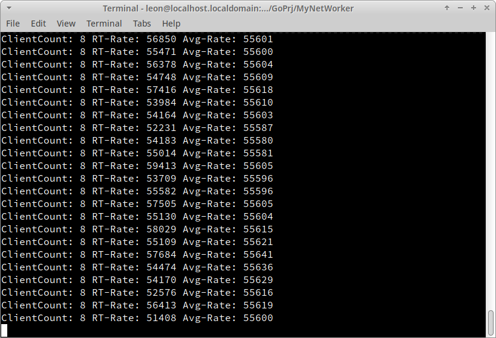

# Language 
[English](README.md) 

[Simplified Chinese](README.zh_cn.md) 

# Golang TCP and UDP communication classes. 

Golang encapsulates highly secure long-connected TCP and plaintext UDP communication. 


## TCP long-connect communication classes 

The TCP communication class mainly solves the following problems in TCP long-connection communication: 

1. Communication security issues 
    - Data leakage due to plaintext transmission or fixed-key transmission.
2. High CPU utilization and low transmission efficiency 
    - The traditional TCP communication protocol has packet header and packet tail identifiers, which need to be checked byte by byte, resulting in high CPU utilization and low transmission efficiency. 
3. Sticky packets 
    - The data of two packets arrives at the same time, the application program needs to do additional packet separation operation. 
4. Split packet 
    - A packet of data arrives in multiple packets: the application needs to do extra packet grouping. 
5. request and reply packet pairing and timeout mechanism 
    - Since TCP long connections usually have separate threads to handle incoming packets, sending and receiving data are executed in different threads, resulting in difficulties in pairing reply packets with request packets, and in determining timeouts. 

### Principles of solving TCP communication security problems 

There are two main security problems in TCP communication: data leakage due to plaintext transmission and data leakage due to key leakage in fixed-key transmission. 

Another situation is TCP hijacking. This situation can be avoided after solving the above two problems, together with regular heartbeat detection, and does not need to be considered separately. 

Therefore, to solve the problem of TCP communication security, we need to realize variable key encryption for data transmission. 

In this class library, we use ECC asymmetric encryption algorithm and AES symmetric encryption algorithm to realize the function of TCP secure communication. The specific process is as follows 

1. TcpListener generates a random ECC public key for each client and sends it to the client.
2. AesTcpClient Encrypts the randomly generated AES key with the received public key and sends it to the server
3. TcpListener receives the AES key and both parties encrypt the communication with the AES key.  

Although the ECC algorithm is relatively slow, it has little impact because it is only used to encrypt the key for the AES algorithm, the amount of data is small, and it is only used at the beginning of the connection. <br />
Although the public key of the ECC algorithm is transmitted in the clear, security can be guaranteed because ECC is an asymmetric encryption algorithm and decryption requires a private key, which is not transmitted over the network. <br />
After the client passes the AES key to the server using the ECC public key, the two parties use the AES algorithm to encrypt the communication. <br />
Since the AES algorithm is a symmetric encryption, the encryption is efficient and has less impact on the efficiency of communication. <br />
Since the ECC key and AES key in AesTcpClient are randomly generated, there is no security issue caused by key leakage. <br />
Anyone (including the developers themselves) who wants to see the contents of AesTcpClient communications can only do so by brute-force cracking, and the brute-force cracking time for both the ECC and AES algorithms (under current computing power conditions) is over a hundred years. <br />
In summary, communication between AesTcpClient is very secure.

### TCP server usage 

``` golang 
var client *networker.AesTcpClient 

func main() { 
	//Create the server 
	lsnr := networker.TcpListener{} 

	//Specify the server-side authentication method 
	lsnr.OnAuthorize = func(name, pwd string) bool { 
		return name == “admin” && pwd == “admin” 
	} 

	//What the server does when it receives a client 
	lsnr.OnClientAccepted = func(conn *net.Conn) { 
		tmBegin := time.Now() 

		//The networker.AuthorizeConn method encapsulates the key exchange, callback authentication method actions 
		aesClient := networker.AuthorizeConn(&lsnr, conn) 

		fmt.Println(time.Now(), “Authorize cost time:”, time.Since(tmBegin)) 

		// Authentication success is not nil 
		if nil ! = aesClient { 
			client = aesClient 

			// Set the client request handling method 
			client.SetAesPackageHandler(func (tcp *networker.AesTcpClient, pkg *networker.AesPackage) { 
				fmt.Println(“clientPkgHandler Received: SN=”, pkg.PacSN, “ JSON=”, pkg.Json, “ Cmd=”, pkg.Cmd, “len(ExtData)=”, len(pkg.ExtData)) 

				cmd := networker.AesCmd{ 
					Data: nil, 
					AesCmd{ Data: nil, IsOK: true, 
					Msg: “eccclient got ” + pkg. 
				} 

				jstr, err := json.Marshal(cmd) 
				if nil ! = err { 
					fmt.Println(err) 
				} 

				// Reply to the request. The highest position of the PacSN must be 1 in order to match as a result of the client's request, otherwise the client is treated as a server-side request.
				tcp.SendJson(0x8000|pkg.PacSN, networker.Cmd_Test, string(jstr), nil) 
			}) 
		} 
	} 

	// Start listening on the specified port 
	lsnr.Start(5868) 
} 
``` 

### TCP client usage 

``` golang 
func main() { 
	// Create the AesTcpClient.
	cli := networker.AesTcpClient{}

	// Connect to the server to request authentication
	if !cli.Login(“127.0.0.1”, 5868, “admin”, “admin”, 3000) {
		fmt.Println(“Failed to authorize”)
		fmt.Println(“Failed to authorize”)
	}

	go func() {
		// Create a new request command object
		cmd := networker.AesCmd{
			Data: nil,
			IsOK: true,
			Msg: “”,
		}

		for {
			// Serialize the command object
			cmd.Msg = “Now is ‘ + time.Now().Format(’15:04:05”)
			jstr, err := json.Marshal(cmd)
			if nil ! = err {
				fmt.Println(err)
			}

			// Send the request command and wait for the result
			pac := cli.SendJsonAndWait(networker.GetNexPacSN(), networker.Cmd_Test, string(jstr), nil, 3000)
			if nil ! = pac {
				fmt.Println("cli got answer: ”, string(pac.Json))
			}

			time.Sleep(time.Second * 3)
		}
	}()
}
``` 

### Throughput 
 System： 
     OS: Open SUSE leap 15.5 x64 
    CPU: Intel E5-2650 v2 
 Memory: 16G DDR3 1333 

1. Single Client 
  

1. 8 Clients 
  

1. 15 Clients 
  

## UDP communication classes

The UDP communication class encapsulates the most basic send and receive operations. The content of the communication is transmitted in clear text. See the UdpDemo code in main.go for details.
